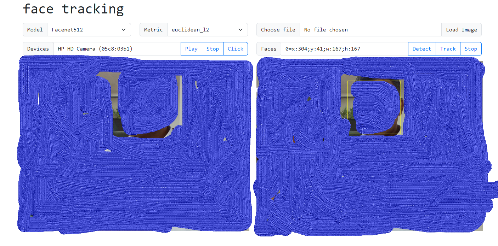

# python-face-track-api

Face detection and real time tracking using `OpenCV` and `deepface` Python libraries.

## Running the application locally

- `uvicorn main:api`
- Open [http://localhost:8000/ui/track.html](http://localhost:8000/ui/track.html) in web browser
